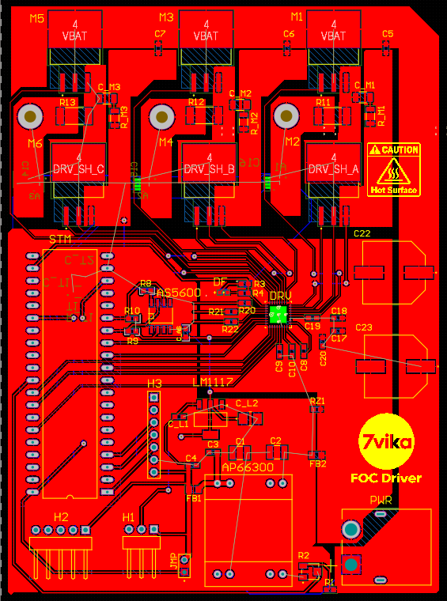
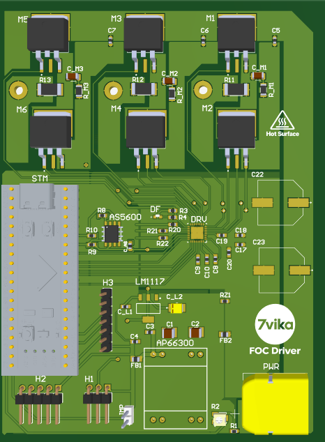
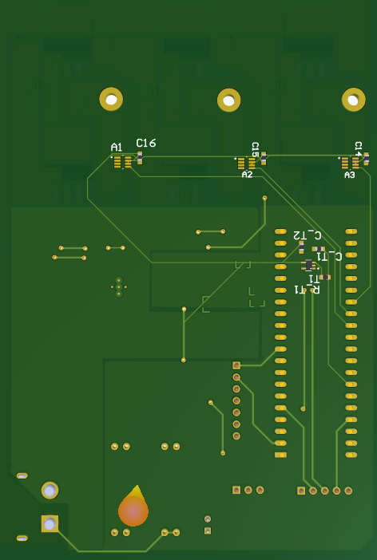

# BLDC FOC Motor Controller - Major Project

A custom 1.5 kW BLDC Field-Oriented Control (FOC) motor controller developed as a major project for 2-wheeler EV applications.

The project focuses on designing an EV-grade motor controller PCB from scratch using Altium Designer, based on an STM32F411 Blackpill and DRV8350H Smart Gate Driver, with CSD1953KTT N-channel MOSFETs, inline current sensing, CAN communication, and encoder connectivity.

## PCB Design

  

### 3D PCB

  

### PCB Back View

  

## Features

- 1.5 kW BLDC motor drive capability
- STM32F411 microcontroller
- DRV8350H Smart Gate Driver
- CSD1953KTT N-channel MOSFETs
- Inline bidirectional current sensing for FOC
- CAN communication
- Encoder interface
- Designed in Altium Designer
- 4-layer PCB architecture

## Control and Sensing

The controller is designed for Field-Oriented Control (FOC) with inline phase-current measurement for closed-loop motor control.

The hardware includes dedicated interfaces for motor position feedback through an encoder, CAN communication, and gate-driver control.

## Project Status

Ongoing: PCB Design and Hardware Validation
